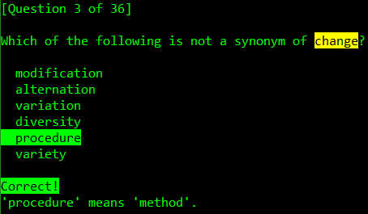
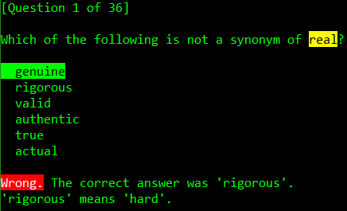

# Command Line Synonyms Practice Tool

A simple command line synonyms practice tool.

## Screenshots





## How to Add Words

1. Create a file named `WordsList.txt` in the same folder as the executable file.
2. On each line of the file write the keyword, the keyword part of speech (verb, noun, adjective, etc.), and at least one synonym - all separated by commas in the following format: `[keyword],[keyword part of speech],[synonym]` or `[keyword],[keyword part of speech],[synonym1],[synonym2],[synonym3],...`

### `WordsList.txt` Example
```CSV
change,noun,modification,alternation,variation,diversity,variety
method,noun,process,way,manner,system,procedure
real,adjective,genuine,valid,authentic,true,actual
hard,adjective,stern,rigorous,severe,harsh,exacting
```
